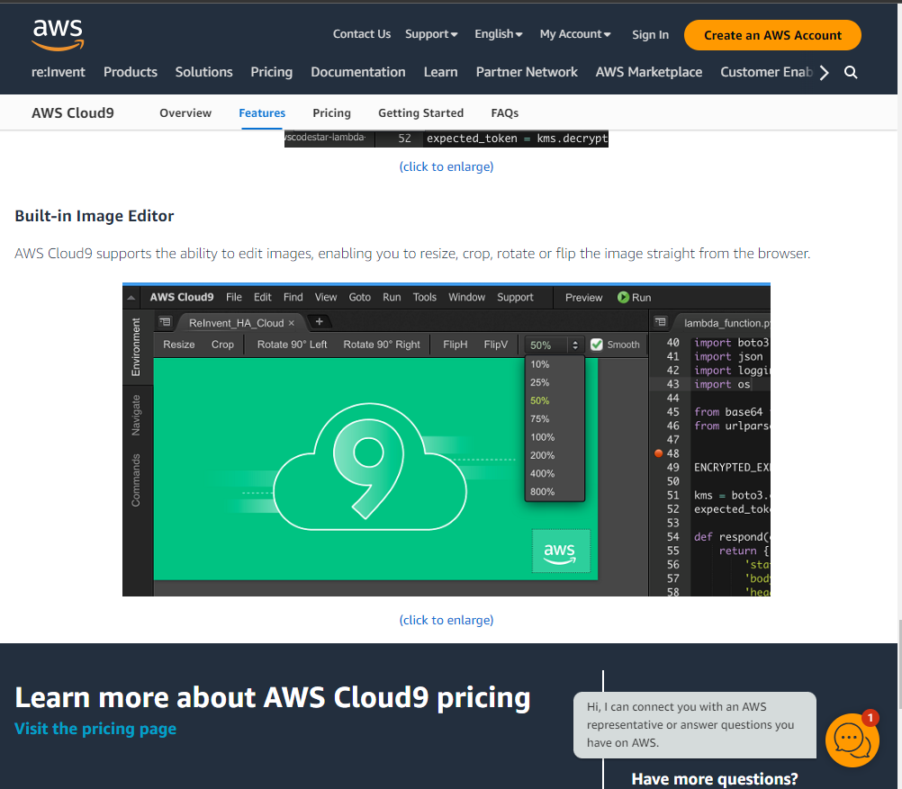

A long time ago (2013)  i introducted a image editor into cloud9

sell time has passed, and amazon picked that as a IDE for online development.

well i noticed that they use my feature as a selling point.

here are my commits, 
  https://github.com/bmatusiak/cloud9/commits/imgEditor/

here is official implementation https://github.com/c9/c9.ide.imgeditor

